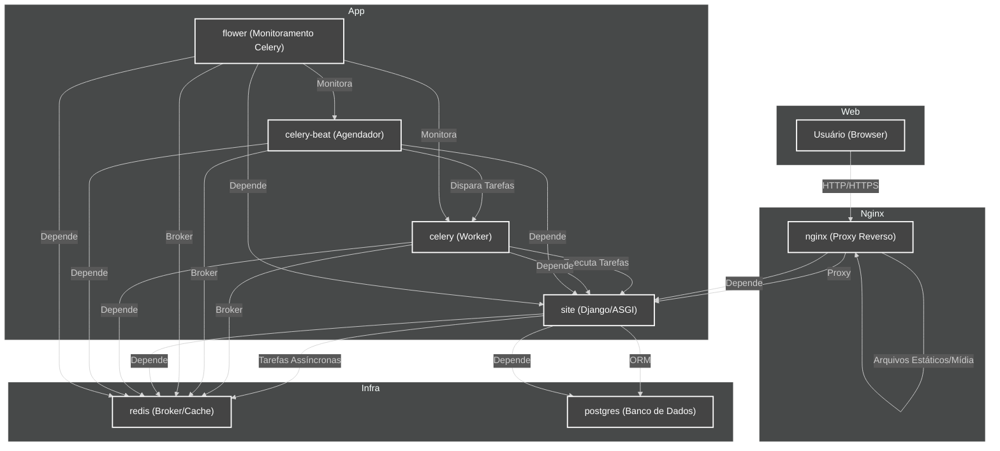

# Diagrama de Arquitetura

Este diagrama representa a arquitetura do projeto, desde o acesso do usuário até o banco de dados, incluindo todos os serviços orquestrados pelo Docker Compose.

## Component Legend
- **User (Browser):** Client accessing the system.
- **nginx:** Reverse proxy, serves static files and forwards requests to Django.
- **site:** Django application running via ASGI (Daphne).
- **celery:** Worker for asynchronous tasks.
- **celery-beat:** Periodic task scheduler.
- **flower:** Celery monitoring and dashboard.
- **redis:** Message broker and cache.
- **postgres:** Relational database.
