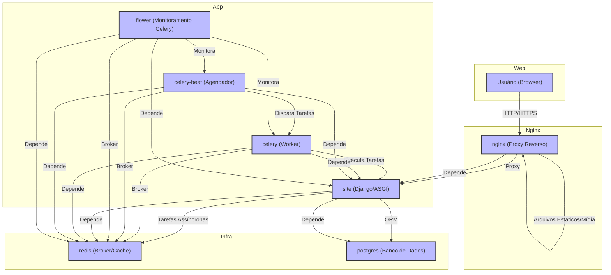

# Diagrama de Arquitetura

Este diagrama representa a arquitetura do projeto, desde o acesso do usuário até o banco de dados, incluindo todos os serviços orquestrados pelo Docker Compose.

## Legenda dos Componentes
- **Usuário (Browser):** Cliente acessando o sistema.
- **nginx:** Proxy reverso, serve estáticos e encaminha requisições para o Django.
- **site:** Aplicação Django rodando via ASGI (Daphne).
- **celery:** Worker para tarefas assíncronas.
- **celery-beat:** Agendador de tarefas periódicas.
- **flower:** Monitoramento e dashboard do Celery.
- **redis:** Broker de mensagens e cache.
- **postgres:** Banco de dados relacional. 