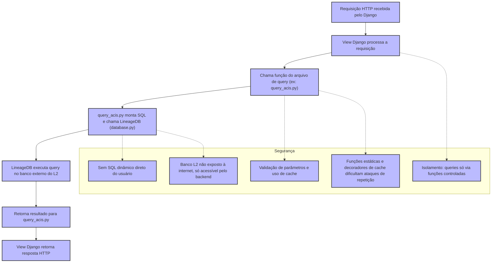

# Diagrama: Segurança no uso do Django para acessar banco externo do Lineage 2

---

## Explicação Detalhada do Fluxo e Segurança

### 1. Recepção da Requisição
- O Django recebe uma requisição HTTP (ex: GET/POST de um usuário).
- A requisição é roteada para uma view específica.

### 2. Processamento pela View
- A view Django é responsável por validar permissões, autenticação e sanitizar dados recebidos.
- Não há passagem direta de SQL ou comandos do usuário para o banco externo.

### 3. Chamada de Função de Query
- A view chama funções específicas em arquivos de query (ex: `query_acis.py`).
- Essas funções são estáticas, bem definidas e recebem apenas parâmetros controlados.

### 4. Montagem e Execução da Query
- O arquivo de query monta a SQL usando parâmetros (nunca concatenação direta de strings do usuário).
- A execução é feita via a classe `LineageDB` (em `database.py`), que centraliza e controla o acesso ao banco externo do L2.

### 5. Execução no Banco Externo
- O banco do L2 não está exposto à internet, apenas acessível pelo backend do Django.
- O acesso é feito por conexão segura e controlada.

### 6. Retorno dos Dados
- O resultado da query retorna para o arquivo de query, depois para a view, e finalmente para o usuário, já processado e validado.

---

## Pontos de Segurança

- **Isolamento:** O usuário nunca acessa o banco externo diretamente. Todas as queries passam por funções controladas e revisadas.
- **Validação e Cache:** Parâmetros são validados e, quando possível, resultados são cacheados, reduzindo carga e risco de ataques de repetição.
- **Sem SQL Injection:** Não há montagem de SQL dinâmica com dados do usuário. Sempre se usa parâmetros.
- **Banco não exposto:** O banco do L2 só pode ser acessado pelo backend, nunca diretamente da internet.
- **Funções Estáticas e Decoradores:** O uso de funções estáticas e decoradores de cache dificulta ataques automatizados e brute force.

---

## Conclusão

Esse modelo garante que o acesso ao banco externo do Lineage 2 seja feito de forma segura, controlada e auditável, minimizando riscos de segurança comuns em integrações entre sistemas web e bancos de dados legados ou externos. 