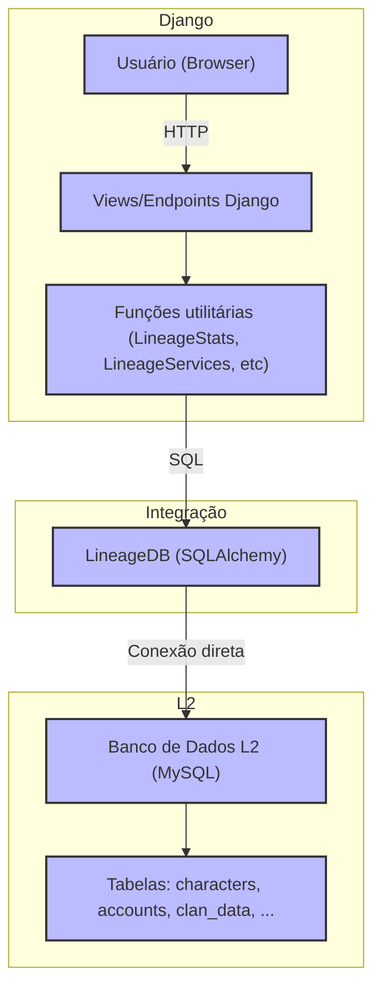

# Diagrama de Integração: Django x Banco do L2

Este diagrama ilustra como o app `apps.lineage.server` faz a ponte entre o Django e o banco de dados do Lineage 2 (L2), detalhando o fluxo de dados e responsabilidades de cada camada.

## Legenda
- **Usuário (Browser):** Cliente acessando o site.
- **Views/Endpoints Django:** Camada de apresentação e API.
- **Funções utilitárias:** Camada de lógica que prepara e executa queries.
- **LineageDB:** Classe de integração, faz a ponte entre Django e o banco do L2 usando SQLAlchemy.
- **Banco de Dados L2:** Base de dados do servidor de jogo, com tabelas específicas do Lineage 2. 