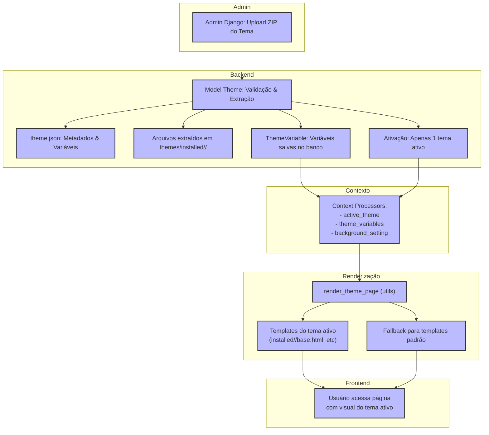

# Diagrama do Funcionamento do Sistema de Temas

Este diagrama mostra o fluxo completo do sistema de temas, desde o upload do ZIP até a renderização das páginas com o tema ativo.

## Legenda
- **Admin Django:** Upload e gerenciamento dos temas.
- **Model Theme:** Validação, extração e ativação do tema.
- **theme.json:** Metadados e variáveis do tema.
- **Arquivos extraídos:** Templates, CSS, JS, imagens, etc.
- **ThemeVariable:** Variáveis salvas e internacionalizadas.
- **Context Processors:** Injeção de contexto nos templates.
- **render_theme_page:** Função utilitária para renderização dinâmica.
- **Templates do tema ativo:** Templates customizados do tema.
- **Fallback:** Uso dos templates padrão caso não exista no tema.
- **Usuário:** Visualiza o site com o tema ativo. 