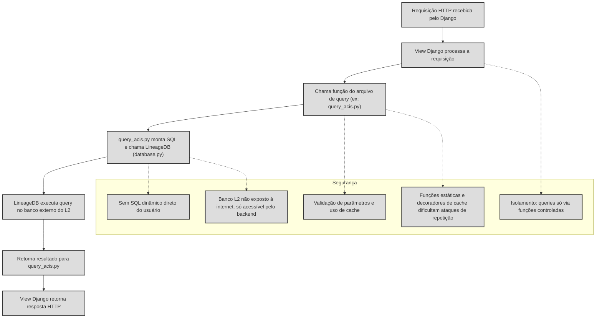

# Diagrama: Segurança no uso do Django para acessar banco externo do Lineage 2

---

## Detailed Flow and Security Explanation

### 1. Request Reception
- Django receives an HTTP request (e.g., GET/POST from a user).
- The request is routed to a specific view.

### 2. View Processing
- The Django view is responsible for validating permissions, authentication, and sanitizing received data.
- There is no direct passing of SQL or user commands to the external database.

### 3. Query Function Call
- The view calls specific functions in query files (e.g., `query_acis.py`).
- These functions are static, well-defined, and only receive controlled parameters.

### 4. Query Assembly and Execution
- The query file assembles the SQL using parameters (never direct string concatenation from the user).
- Execution is done via the `LineageDB` class (in `database.py`), which centralizes and controls access to the external L2 database.

### 5. Execution in the External Database
- The L2 database is not exposed to the internet, only accessible by the Django backend.
- Access is made through a secure and controlled connection.

### 6. Data Return
- The query result returns to the query file, then to the view, and finally to the user, already processed and validated.

---

## Security Points

- **Isolation:** The user never accesses the external database directly. All queries go through controlled and reviewed functions.
- **Validation and Cache:** Parameters are validated and, when possible, results are cached, reducing load and risk of replay attacks.
- **No SQL Injection:** There is no dynamic SQL assembly with user data. Parameters are always used.
- **Database not exposed:** The L2 database can only be accessed by the backend, never directly from the internet.
- **Static Functions and Decorators:** The use of static functions and cache decorators makes automated and brute force attacks more difficult.

---

## Conclusion

This model ensures that access to the external Lineage 2 database is done securely, in a controlled and auditable way, minimizing common security risks in integrations between web systems and legacy or external databases.