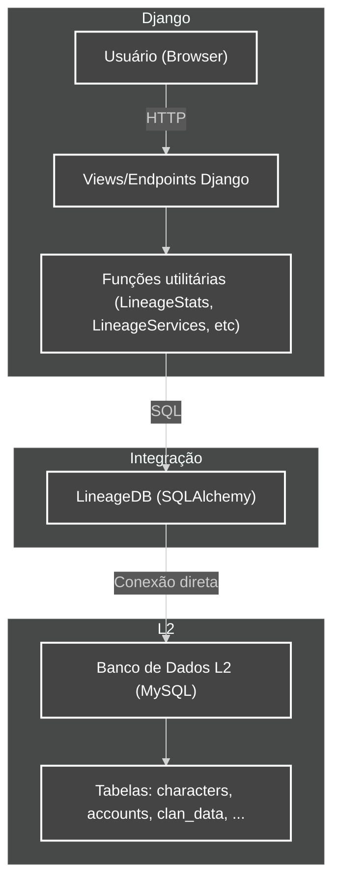

# Diagrama de Integração: Django x Banco do L2

Este diagrama ilustra como o app `apps.lineage.server` faz a ponte entre o Django e o banco de dados do Lineage 2 (L2), detalhando o fluxo de dados e responsabilidades de cada camada.

## Legend
- **User (Browser):** Client accessing the site.
- **Views/Endpoints Django:** Presentation and API layer.
- **Utility functions:** Logic layer that prepares and executes queries.
- **LineageDB:** Integration class, bridges Django and the L2 database using SQLAlchemy.
- **L2 Database:** Game server database, with specific Lineage 2 tables.