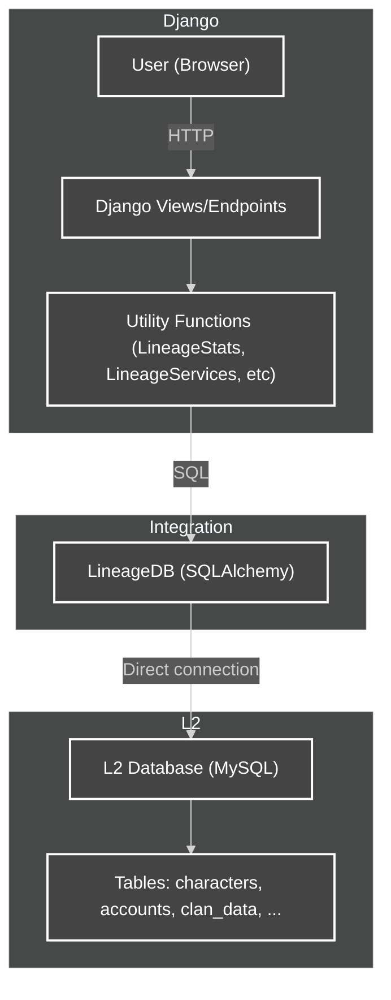

# Integration Diagram: Django x L2 Database

This diagram illustrates how the `apps.lineage.server` app bridges Django and the Lineage 2 (L2) database, detailing the data flow and responsibilities of each layer.

## Legend
- **User (Browser):** Client accessing the site.
- **Django Views/Endpoints:** Presentation and API layer.
- **Utility Functions:** Logic layer that prepares and executes queries.
- **LineageDB:** Integration class, bridges Django and the L2 database using SQLAlchemy.
- **L2 Database:** Game server database, with specific Lineage 2 tables.