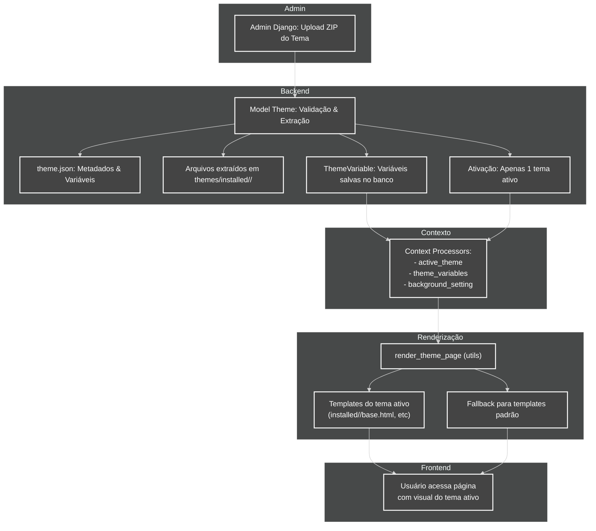

# Diagrama do Funcionamento do Sistema de Temas

Este diagrama mostra o fluxo completo do sistema de temas, desde o upload do ZIP até a renderização das páginas com o tema ativo.

## Legend
- **Django Admin:** Theme upload and management.
- **Theme Model:** Validation, extraction, and activation of the theme.
- **theme.json:** Theme metadata and variables.
- **Extracted files:** Templates, CSS, JS, images, etc.
- **ThemeVariable:** Saved and internationalized variables.
- **Context Processors:** Inject context into templates.
- **render_theme_page:** Utility function for dynamic rendering.
- **Templates of active theme:** Customized theme templates.
- **Fallback:** Use default templates if not present in the theme.
- **User:** Views the site with the active theme.