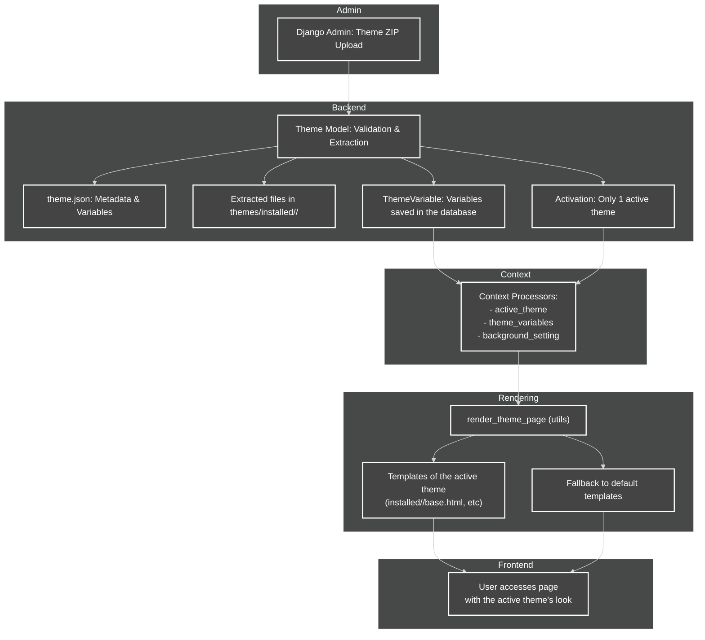

# Theme System Flow Diagram

This diagram shows the complete flow of the theme system, from ZIP upload to page rendering with the active theme.

## Legend
- **Django Admin:** Theme upload and management.
- **Theme Model:** Validation, extraction, and activation of the theme.
- **theme.json:** Theme metadata and variables.
- **Extracted files:** Templates, CSS, JS, images, etc.
- **ThemeVariable:** Saved and internationalized variables.
- **Context Processors:** Inject context into templates.
- **render_theme_page:** Utility function for dynamic rendering.
- **Templates of active theme:** Customized theme templates.
- **Fallback:** Use default templates if not present in the theme.
- **User:** Views the site with the active theme.